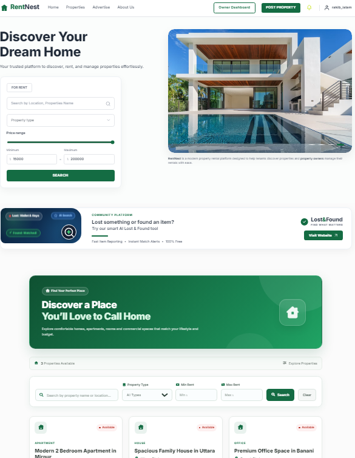
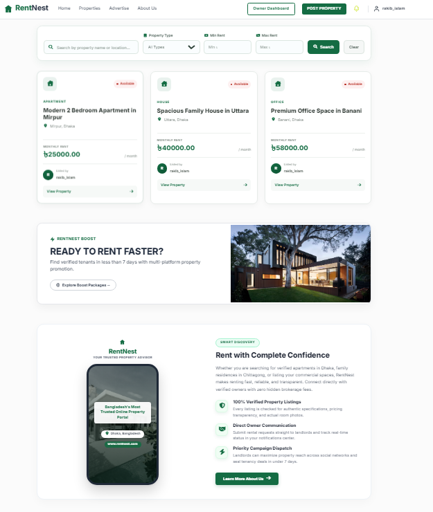
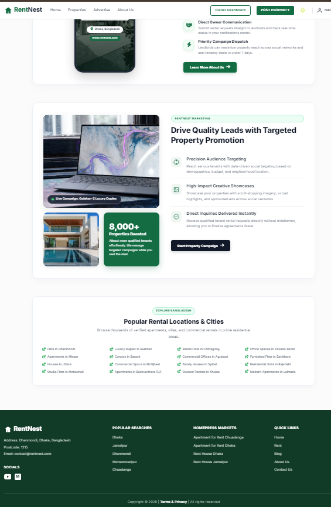
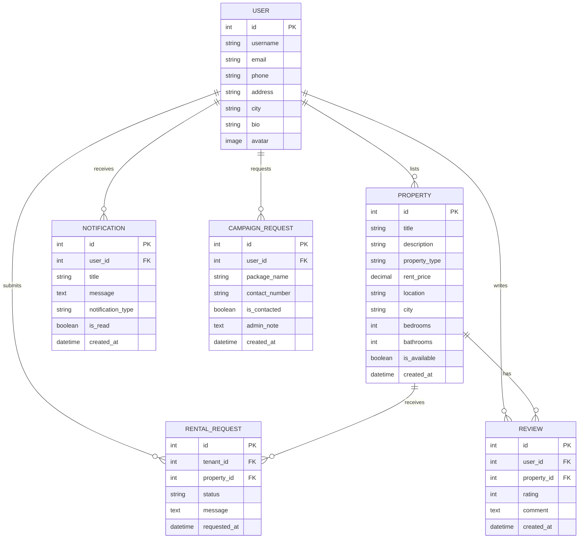

<div align="center">

# 🏠 RentNest
### Next-Generation Property Rental & Management System

[](https://www.python.org/)
[](https://www.djangoproject.com/)
[](https://www.postgresql.org/)
[](https://getbootstrap.com/)
[](https://fontawesome.com/)
[](LICENSE)

<br/>

**RentNest** is a full-featured, modern, and intuitive web-based Property Rental & Management Platform tailored for landlords, property managers, and prospective tenants. Designed with a clean, high-performance UI and an enterprise-grade Django backend architecture, RentNest simplifies property exploration, rental applications, real-time owner-tenant communications, and multi-platform advertising campaigns.

[Explore Features](#-key-features) • [Screenshots](#-visual-showcase) • [Tech Stack](#-technology-stack) • [Installation](#-installation--setup) • [System Architecture](#-project-architecture)

---

</div>

## 📑 Table of Contents

- [✨ Key Features](#-key-features)
- [📸 Visual Showcase](#-visual-showcase)
- [🛠️ Technology Stack](#️-technology-stack)
- [🏗️ Project Architecture](#️-project-architecture)
- [🚀 Installation & Setup](#-installation--setup)
- [🔐 Environment Variables Configuration](#-environment-variables-configuration)
- [🧭 Route & URL Reference](#-route--url-reference)
- [📄 Database Models & Schema](#-database-models--schema)
- [👥 Contributing](#-contributing)
- [📜 License](#-license)

---

## ✨ Key Features

### 🔍 1. Smart Property Discovery & Advanced Filtering
- **Multi-Factor Search Engine**: Search properties seamlessly by title, keywords, city, or neighborhood.
- **Dynamic Filter Controls**: Filter by property categories (*Apartment*, *Family House*, *Studio*, *Commercial Office*), exact rent price range, and availability status.
- **Interactive UI Metrics**: Real-time counter of available properties with instant state clearing.

### 🏢 2. Comprehensive Property Management (CRUD)
- **High-Definition Listings**: Property owners can upload multiple high-resolution photos with responsive thumbnail galleries.
- **Detailed Specifications**: Comprehensive fields for bedroom counts, washroom counts, square footage, furnished status, utility inclusions, and neighborhood details.
- **Live Availability Toggle**: Landlords can easily switch listing status between *Available* and *Rented* with a single click.

### 🚀 3. RentNest Boost & Multi-Platform Marketing Engine
- **Targeted Tenant Campaigns**: Dedicated advertising portal enabling property owners to launch high-impact digital campaigns across social channels.
- **"Chithir Kham" Interactive Envelope Experience**: An authentic, animated letter-envelope modal submission flow with sound feedback and visual sealing animations.
- **Admin Review Workflow**: Admin dashboard to review, approve, and add custom notes to campaign inquiries.
- **Automated Notifications**: Real-time dispatch of in-app notifications whenever admin contacts landlords regarding campaign requests.

### 🔔 4. Real-Time Notification Center
- **Unread Counter Badge**: Header bell indicator with dynamic live badge counts powered by Django context processors.
- **Categorized Alerts**: Differentiates rental requests, booking confirmations, admin campaign responses, and system updates.
- **One-Click Read Management**: Mark individual or all notifications as read instantly.

### 📊 5. Landlord & Owner Dashboard
- **Centralized Command Center**: Track total listed properties, pending tenant applications, verified rentals, and revenue projections.
- **Rental Request Processing**: Accept or decline incoming tenancy requests with direct status notifications sent back to applicants.

### ⭐ 6. Ratings & Community Reviews
- **Verified Tenant Reviews**: Leave star ratings (1–5) and written feedback for properties and owners.
- **Reputation Transparency**: Helps prospective tenants make informed decisions with genuine landlord and property feedback.

### 🌐 7. Interactive About Us & Nationwide Hotspots
- **Brand Story & Milestones**: Company vision, core values, leadership showcase, customer testimonials, and interactive FAQ accordions.
- **Explore Bangladesh Directory**: Quick-access link directory covering prime residential and commercial zones across Dhaka, Chittagong, Sylhet, Khulna, and Rajshahi.

---

## 📸 Visual Showcase

<div align="center">

### 1. Modern Homepage Hero, AI Tools & Multi-Filter Search
*A stunning hero section with interactive price sliders, real-time property counters, and community tools.*



<br/>

### 2. Live Listings Grid, Boost Banner & Smart Discovery
*Showcasing verified property cards with pricing badges, landlord avatars, RentNest Boost promotion, and the smartphone app frame mockup.*



<br/>

### 3. Targeted Marketing Showcase, Popular Locations & Footer
*Laptop mockup with live campaign indicators, 8,000+ stat badge, 4-column prime location directory, and professional footer.*



</div>

---

## 🛠️ Technology Stack

| Layer | Technologies |
| :--- | :--- |
| **Backend Framework** | [Django 6.0](https://www.djangoproject.com/) (Python 3.10+) |
| **Database** | [PostgreSQL](https://www.postgresql.org/) / [SQLite](https://www.sqlite.org/) |
| **Frontend Core** | HTML5, Modern Vanilla CSS3, JavaScript (ES6+) |
| **Styling & Icons** | [Bootstrap 5.3](https://getbootstrap.com/), [Font Awesome 6](https://fontawesome.com/) |
| **Form Handling** | Django Crispy Forms & Crispy Bootstrap 5 |
| **Image Processing** | [Pillow (PIL)](https://python-pillow.org/) |
| **Environment Management** | `python-dotenv`, `dj-database-url` |

---

## 🏗️ Project Architecture

RentNest is architected following Django's modular app structure, maintaining high separation of concerns:

```
Property Rental & Management System/
│
├── core/                       # Project Configuration & Settings
│   ├── settings.py             # Global settings, context processors, DB config
│   ├── urls.py                 # Master URL routing
│   ├── views.py                # Global home view controller
│   └── wsgi.py                 # WSGI deployment configuration
│
├── accounts/                   # User Authentication & Custom Profiles
│   ├── models.py               # Custom User model (phone, bio, address, role)
│   ├── views.py                # Login, Register, Logout, Profile update
│   └── urls.py                 # Auth route endpoints
│
├── properties/                 # Core Property Management
│   ├── models.py               # Property, RentalRequest, Notification models
│   ├── views.py                # CRUD views, search filters, request processing
│   ├── forms.py                # Property listing and rental forms
│   └── context_processors.py  # Global unread notification counter
│
├── advertise/                  # Property Boost & Marketing Portal
│   ├── models.py               # CampaignRequest model (admin notes, contact status)
│   ├── views.py                # Boost packages, contact modal, envelope submission
│   └── static/advertise/       # Custom marketing stylesheets and envelope animations
│
├── dashboard/                  # Landlord & Property Owner Command Center
│   ├── views.py                # Analytics, property list, incoming rental requests
│   └── urls.py                 # Dashboard routing
│
├── about_us/                   # Company Profile & Directory
│   ├── views.py                # About Us view
│   ├── static/about_us/        # Team grids, phone mockup, FAQ styling
│   └── urls.py                 # About page routing
│
├── reviews/                    # Rating & Review Engine
│   ├── models.py               # PropertyReview model
│   └── views.py                # Review creation and moderation
│
├── templates/                  # Base Templates & Shared Partials
│   ├── base.html               # Master layout with navbar & footer
│   ├── home.html               # Main landing page with integrated sections
│   ├── carousel.html           # Promotional hero carousel
│   └── carousel_bottom_ad.html # Lost & Found community widget
│
├── static/                     # Global Static Assets (CSS, JS, Images)
├── screenshots/                # Showcase Screenshots for Documentation
├── media/                      # Uploaded Property Photos & User Avatars
└── manage.py                   # Django Management CLI
```

---

## 🚀 Installation & Setup

Follow these steps to set up and run RentNest on your local machine:

### 1. Clone the Repository
```bash
git clone https://github.com/AbdullahNoman-01/Property-Rental-Management-System.git
cd "Property Rental & Management System"
```

### 2. Set Up a Virtual Environment
```bash
# Windows
python -m venv venv
venv\Scripts\activate

# macOS / Linux
python3 -m venv venv
source venv/bin/activate
```

### 3. Install Dependencies
```bash
pip install -r requirements.txt
```
*(Alternatively, if running without `requirements.txt`, install core packages:)*
```bash
pip install django pillow python-dotenv psycopg2-binary django-crispy-forms crispy-bootstrap5 django-filter
```

### 4. Configure Environment Variables
Create a `.env` file in the project root directory:
```env
SECRET_KEY=your-django-super-secret-key-here
DEBUG=True

# Database Configuration (PostgreSQL or SQLite)
ENGINE=django.db.backends.sqlite3
NAME=db.sqlite3
USER=
PASSWORD=
HOST=
PORT=
```

### 5. Run Database Migrations
```bash
python manage.py migrate
```

### 6. Create Superuser (Admin Account)
```bash
python manage.py createsuperuser
```

### 7. Launch Development Server
```bash
python manage.py runserver
```

Open your browser and navigate to:
```
http://127.0.0.1:8000/
```

---

## 🔐 Environment Variables Configuration

| Variable | Description | Default / Example |
| :--- | :--- | :--- |
| `SECRET_KEY` | Unique Django secret cryptographic key | `django-insecure-...` |
| `DEBUG` | Development mode toggle (`True` / `False`) | `True` |
| `ENGINE` | Database engine | `django.db.backends.postgresql` or `django.db.backends.sqlite3` |
| `NAME` | Database name or SQLite file path | `rentnest_db` or `db.sqlite3` |
| `USER` | Database username (for PostgreSQL) | `postgres` |
| `PASSWORD` | Database user password | `your_db_password` |
| `HOST` | Database host server | `127.0.0.1` |
| `PORT` | Database port number | `5432` |

---

## 🧭 Route & URL Reference

| App | Path | Description |
| :--- | :--- | :--- |
| **Core** | `/` | Main Homepage with hero, properties grid, boost, and locations |
| **Admin** | `/admin/` | Django Administration control panel |
| **Accounts** | `/accounts/login/` | User authentication & sign-in |
| **Accounts** | `/accounts/register/` | New user / landlord registration |
| **Accounts** | `/accounts/profile/` | User profile & avatar management |
| **Properties** | `/properties/` | Full property catalog with search & filters |
| **Properties** | `/properties/create/` | Add a new property listing (Landlord only) |
| **Properties** | `/properties/<id>/` | Detailed property view with specifications |
| **Properties** | `/properties/notifications/` | User notification center |
| **Dashboard** | `/dashboard/` | Landlord management dashboard |
| **Advertise** | `/advertise/` | RentNest Boost packages & campaign submission |
| **About Us** | `/about-us/` | Corporate overview, company stats, and FAQ |

---

## 📄 Database Models & Schema



---

## 👥 Contributing

Contributions, issues, and feature requests are welcome!

1. Fork the Project (`https://github.com/AbdullahNoman-01/Property-Rental-Management-System/fork`)
2. Create your Feature Branch (`git checkout -b feature/AmazingFeature`)
3. Commit your Changes (`git commit -m 'Add some AmazingFeature'`)
4. Push to the Branch (`git push origin feature/AmazingFeature`)
5. Open a Pull Request

---

## 📜 License

Distributed under the **MIT License**. See `LICENSE` for more information.

---

<div align="center">

Developed with ❤️ by **Abdullah Noman** & Team • Empowering Renters & Landlords Across Bangladesh.

</div>
